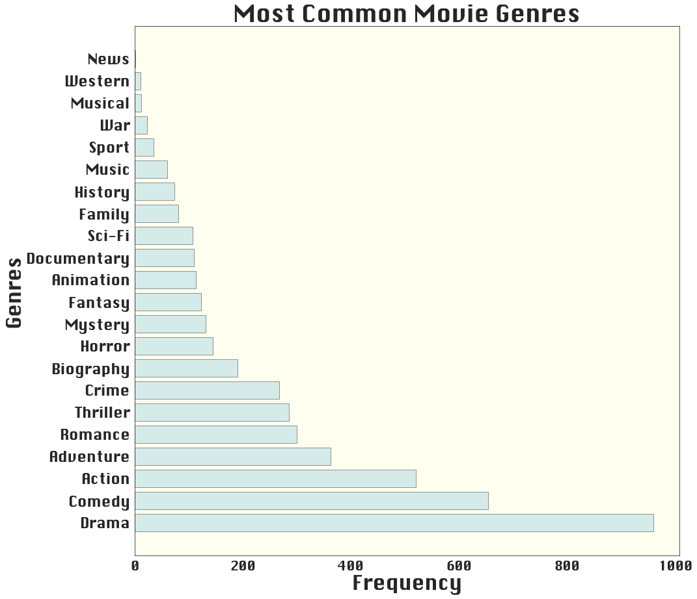
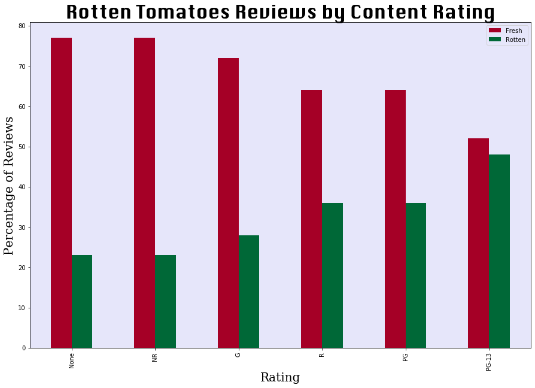
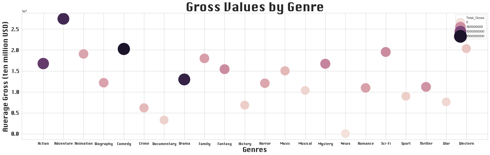
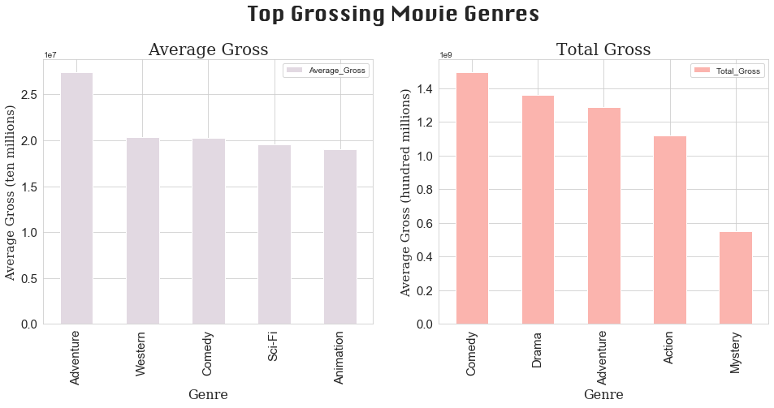
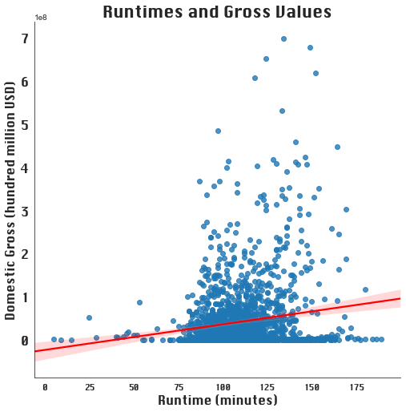
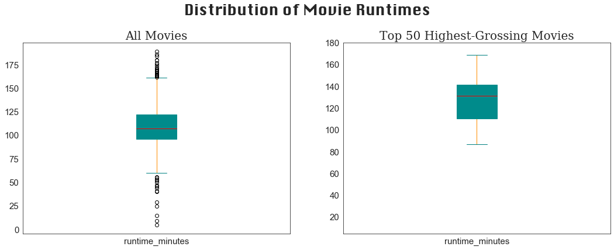

# Final Project Submission

Student name: Avonlea Fisher

Student pace: full time

Scheduled project review date/time: 8/1 at 4:00PM

Instructor name: James Irving

Blog post URL: 

# Introduction

This project explores movie industry data to determine which types of movies have been most successful. The hypothetical context for this analysis is that Microsoft is interested in creating and selling original video content. The company has hired a team of analysts to inform their decisions about the types of films it should be creating. The project will consist of an analytical component, visualizations, and a presentation of the findings for non-technical audiences.

# Questions

The analysis will aim to address three questions about the movie industry:
1. What types of movies (genre and content rating) are the most popular?
2. What are the highest-grossing movie genres?
3. What is the ideal range for movie runtimes, in terms of profitability? 

# Data Description

### IMBD
The analysis explores a merged form of two IMBD datasets: one which contains data on domestic and foreign grossses, and one with data on runtimes and genres. 

### Rotten Tomatoes
To address the question about movie popularity, the IMBD data is supplemented with two datasets from Rotten Tomatoes, which contain data on movie ratings and reviews.

# Data Cleaning

## IMBD Data 
We will use <b>pandas</b> to read, clean, and format the IMBD data into a workable dataframe. Let's read and preview the movie gross dataset:


```python
import pandas as pd
Movie_Gross = pd.read_csv(
'/Users/avonleafisher/Desktop/Flatiron Data Science/section01/11_Final Project/zippedData/bom.movie_gross.csv.gz', nrows=100000, compression='gzip',
                   error_bad_lines=False)
Movie_Gross.head()
```


<div>
<style scoped>
    .dataframe tbody tr th:only-of-type {
        vertical-align: middle;
    }

    .dataframe tbody tr th {
        vertical-align: top;
    }

    .dataframe thead th {
        text-align: right;
    }
</style>
<table border="1" class="dataframe">
  <thead>
    <tr style="text-align: right;">
      <th></th>
      <th>title</th>
      <th>studio</th>
      <th>domestic_gross</th>
      <th>foreign_gross</th>
      <th>year</th>
    </tr>
  </thead>
  <tbody>
    <tr>
      <th>0</th>
      <td>Toy Story 3</td>
      <td>BV</td>
      <td>415000000.0</td>
      <td>652000000</td>
      <td>2010</td>
    </tr>
    <tr>
      <th>1</th>
      <td>Alice in Wonderland (2010)</td>
      <td>BV</td>
      <td>334200000.0</td>
      <td>691300000</td>
      <td>2010</td>
    </tr>
    <tr>
      <th>2</th>
      <td>Harry Potter and the Deathly Hallows Part 1</td>
      <td>WB</td>
      <td>296000000.0</td>
      <td>664300000</td>
      <td>2010</td>
    </tr>
    <tr>
      <th>3</th>
      <td>Inception</td>
      <td>WB</td>
      <td>292600000.0</td>
      <td>535700000</td>
      <td>2010</td>
    </tr>
    <tr>
      <th>4</th>
      <td>Shrek Forever After</td>
      <td>P/DW</td>
      <td>238700000.0</td>
      <td>513900000</td>
      <td>2010</td>
    </tr>
  </tbody>
</table>
</div>


Now let's preview the other dataset:


```python
IMBD_Basics = pd.read_csv(
'/Users/avonleafisher/Desktop/Flatiron Data Science/section01/11_Final Project/zippedData/imdb.title.basics.csv.gz', nrows=1000000, compression='gzip',
                   error_bad_lines=False)
IMBD_Basics.head()
```


<div>
<style scoped>
    .dataframe tbody tr th:only-of-type {
        vertical-align: middle;
    }

    .dataframe tbody tr th {
        vertical-align: top;
    }

    .dataframe thead th {
        text-align: right;
    }
</style>
<table border="1" class="dataframe">
  <thead>
    <tr style="text-align: right;">
      <th></th>
      <th>tconst</th>
      <th>primary_title</th>
      <th>original_title</th>
      <th>start_year</th>
      <th>runtime_minutes</th>
      <th>genres</th>
    </tr>
  </thead>
  <tbody>
    <tr>
      <th>0</th>
      <td>tt0063540</td>
      <td>Sunghursh</td>
      <td>Sunghursh</td>
      <td>2013</td>
      <td>175.0</td>
      <td>Action,Crime,Drama</td>
    </tr>
    <tr>
      <th>1</th>
      <td>tt0066787</td>
      <td>One Day Before the Rainy Season</td>
      <td>Ashad Ka Ek Din</td>
      <td>2019</td>
      <td>114.0</td>
      <td>Biography,Drama</td>
    </tr>
    <tr>
      <th>2</th>
      <td>tt0069049</td>
      <td>The Other Side of the Wind</td>
      <td>The Other Side of the Wind</td>
      <td>2018</td>
      <td>122.0</td>
      <td>Drama</td>
    </tr>
    <tr>
      <th>3</th>
      <td>tt0069204</td>
      <td>Sabse Bada Sukh</td>
      <td>Sabse Bada Sukh</td>
      <td>2018</td>
      <td>NaN</td>
      <td>Comedy,Drama</td>
    </tr>
    <tr>
      <th>4</th>
      <td>tt0100275</td>
      <td>The Wandering Soap Opera</td>
      <td>La Telenovela Errante</td>
      <td>2017</td>
      <td>80.0</td>
      <td>Comedy,Drama,Fantasy</td>
    </tr>
  </tbody>
</table>
</div>


Both datasets have a column for the name of individual movies. We can start by merging the datasets along this column, and later account for any set of different movies that share the same title. Below, we generate a list of common titles by looping through unique titles in one dataset and finding matches in the other. 

Note: since the purpose of this step is only to show that there are many common titles, we're only looping through the first 1000 rows. Looping through the whole dataset would take a long time!


```python
Common_titles = []
for title in IMBD_Basics['primary_title'][0:1000].unique(): 
    if title in Movie_Gross['title'][0:1000].unique():
        Common_titles.append(title)
```


```python
print(Common_titles[0:10])
len(Common_titles)
```

    ['On the Road', 'The Rum Diary', 'The Three Stooges', 'Tangled', 'John Carter', 'Cowboys & Aliens', 'Dinner for Schmucks', 'The A-Team', 'The Possession', 'Real Steel']


    90


The above output shows us that merging on common titles would still leave us with a large number of datapoints for our analysis. We'll use <code>df.merge</code> to join the datasets along rows with matching titles.


```python
IMBD_df = Movie_Gross.merge(IMBD_Basics, how='inner', left_on='title', right_on='primary_title')
IMBD_df.head()
```


<div>
<style scoped>
    .dataframe tbody tr th:only-of-type {
        vertical-align: middle;
    }

    .dataframe tbody tr th {
        vertical-align: top;
    }

    .dataframe thead th {
        text-align: right;
    }
</style>
<table border="1" class="dataframe">
  <thead>
    <tr style="text-align: right;">
      <th></th>
      <th>title</th>
      <th>studio</th>
      <th>domestic_gross</th>
      <th>foreign_gross</th>
      <th>year</th>
      <th>tconst</th>
      <th>primary_title</th>
      <th>original_title</th>
      <th>start_year</th>
      <th>runtime_minutes</th>
      <th>genres</th>
    </tr>
  </thead>
  <tbody>
    <tr>
      <th>0</th>
      <td>Toy Story 3</td>
      <td>BV</td>
      <td>415000000.0</td>
      <td>652000000</td>
      <td>2010</td>
      <td>tt0435761</td>
      <td>Toy Story 3</td>
      <td>Toy Story 3</td>
      <td>2010</td>
      <td>103.0</td>
      <td>Adventure,Animation,Comedy</td>
    </tr>
    <tr>
      <th>1</th>
      <td>Inception</td>
      <td>WB</td>
      <td>292600000.0</td>
      <td>535700000</td>
      <td>2010</td>
      <td>tt1375666</td>
      <td>Inception</td>
      <td>Inception</td>
      <td>2010</td>
      <td>148.0</td>
      <td>Action,Adventure,Sci-Fi</td>
    </tr>
    <tr>
      <th>2</th>
      <td>Shrek Forever After</td>
      <td>P/DW</td>
      <td>238700000.0</td>
      <td>513900000</td>
      <td>2010</td>
      <td>tt0892791</td>
      <td>Shrek Forever After</td>
      <td>Shrek Forever After</td>
      <td>2010</td>
      <td>93.0</td>
      <td>Adventure,Animation,Comedy</td>
    </tr>
    <tr>
      <th>3</th>
      <td>The Twilight Saga: Eclipse</td>
      <td>Sum.</td>
      <td>300500000.0</td>
      <td>398000000</td>
      <td>2010</td>
      <td>tt1325004</td>
      <td>The Twilight Saga: Eclipse</td>
      <td>The Twilight Saga: Eclipse</td>
      <td>2010</td>
      <td>124.0</td>
      <td>Adventure,Drama,Fantasy</td>
    </tr>
    <tr>
      <th>4</th>
      <td>Iron Man 2</td>
      <td>Par.</td>
      <td>312400000.0</td>
      <td>311500000</td>
      <td>2010</td>
      <td>tt1228705</td>
      <td>Iron Man 2</td>
      <td>Iron Man 2</td>
      <td>2010</td>
      <td>124.0</td>
      <td>Action,Adventure,Sci-Fi</td>
    </tr>
  </tbody>
</table>
</div>


Now we can drop some of the superfluous columns that won't be relevant for our analysis.


```python
IMBD_df = IMBD_df.drop(columns=['primary_title', 'original_title', 'tconst', 'studio'])
```

By inspecting the first 40 rows of the dataframe, we find that there are some repeated titles. The 'year' and 'start_year' columns for many of these repeats have different values, which suggests that many repeats are different movies have the same name. We want the final dataframe to contain only those rows with values that all correspond to the same movie, so our next step is to filter out movies with mismatched years.


```python
IMBD_df.head(41)
```


<div>
<style scoped>
    .dataframe tbody tr th:only-of-type {
        vertical-align: middle;
    }

    .dataframe tbody tr th {
        vertical-align: top;
    }

    .dataframe thead th {
        text-align: right;
    }
</style>
<table border="1" class="dataframe">
  <thead>
    <tr style="text-align: right;">
      <th></th>
      <th>title</th>
      <th>domestic_gross</th>
      <th>foreign_gross</th>
      <th>year</th>
      <th>start_year</th>
      <th>runtime_minutes</th>
      <th>genres</th>
    </tr>
  </thead>
  <tbody>
    <tr>
      <th>0</th>
      <td>Toy Story 3</td>
      <td>415000000.0</td>
      <td>652000000</td>
      <td>2010</td>
      <td>2010</td>
      <td>103.0</td>
      <td>Adventure,Animation,Comedy</td>
    </tr>
    <tr>
      <th>1</th>
      <td>Inception</td>
      <td>292600000.0</td>
      <td>535700000</td>
      <td>2010</td>
      <td>2010</td>
      <td>148.0</td>
      <td>Action,Adventure,Sci-Fi</td>
    </tr>
    <tr>
      <th>2</th>
      <td>Shrek Forever After</td>
      <td>238700000.0</td>
      <td>513900000</td>
      <td>2010</td>
      <td>2010</td>
      <td>93.0</td>
      <td>Adventure,Animation,Comedy</td>
    </tr>
    <tr>
      <th>3</th>
      <td>The Twilight Saga: Eclipse</td>
      <td>300500000.0</td>
      <td>398000000</td>
      <td>2010</td>
      <td>2010</td>
      <td>124.0</td>
      <td>Adventure,Drama,Fantasy</td>
    </tr>
    <tr>
      <th>4</th>
      <td>Iron Man 2</td>
      <td>312400000.0</td>
      <td>311500000</td>
      <td>2010</td>
      <td>2010</td>
      <td>124.0</td>
      <td>Action,Adventure,Sci-Fi</td>
    </tr>
    <tr>
      <th>5</th>
      <td>Tangled</td>
      <td>200800000.0</td>
      <td>391000000</td>
      <td>2010</td>
      <td>2010</td>
      <td>100.0</td>
      <td>Adventure,Animation,Comedy</td>
    </tr>
    <tr>
      <th>6</th>
      <td>Despicable Me</td>
      <td>251500000.0</td>
      <td>291600000</td>
      <td>2010</td>
      <td>2010</td>
      <td>95.0</td>
      <td>Animation,Comedy,Family</td>
    </tr>
    <tr>
      <th>7</th>
      <td>How to Train Your Dragon</td>
      <td>217600000.0</td>
      <td>277300000</td>
      <td>2010</td>
      <td>2010</td>
      <td>98.0</td>
      <td>Action,Adventure,Animation</td>
    </tr>
    <tr>
      <th>8</th>
      <td>The Chronicles of Narnia: The Voyage of the Da...</td>
      <td>104400000.0</td>
      <td>311300000</td>
      <td>2010</td>
      <td>2010</td>
      <td>113.0</td>
      <td>Adventure,Family,Fantasy</td>
    </tr>
    <tr>
      <th>9</th>
      <td>The King's Speech</td>
      <td>135500000.0</td>
      <td>275400000</td>
      <td>2010</td>
      <td>2010</td>
      <td>118.0</td>
      <td>Biography,Drama,History</td>
    </tr>
    <tr>
      <th>10</th>
      <td>The Karate Kid</td>
      <td>176600000.0</td>
      <td>182500000</td>
      <td>2010</td>
      <td>2010</td>
      <td>140.0</td>
      <td>Action,Drama,Family</td>
    </tr>
    <tr>
      <th>11</th>
      <td>Prince of Persia: The Sands of Time</td>
      <td>90800000.0</td>
      <td>245600000</td>
      <td>2010</td>
      <td>2010</td>
      <td>116.0</td>
      <td>Action,Adventure,Fantasy</td>
    </tr>
    <tr>
      <th>12</th>
      <td>Black Swan</td>
      <td>107000000.0</td>
      <td>222400000</td>
      <td>2010</td>
      <td>2010</td>
      <td>108.0</td>
      <td>Drama,Thriller</td>
    </tr>
    <tr>
      <th>13</th>
      <td>Megamind</td>
      <td>148400000.0</td>
      <td>173500000</td>
      <td>2010</td>
      <td>2010</td>
      <td>95.0</td>
      <td>Action,Animation,Comedy</td>
    </tr>
    <tr>
      <th>14</th>
      <td>Robin Hood</td>
      <td>105300000.0</td>
      <td>216400000</td>
      <td>2010</td>
      <td>2010</td>
      <td>140.0</td>
      <td>Action,Adventure,Drama</td>
    </tr>
    <tr>
      <th>15</th>
      <td>Robin Hood</td>
      <td>105300000.0</td>
      <td>216400000</td>
      <td>2010</td>
      <td>2013</td>
      <td>92.0</td>
      <td>Action,Drama</td>
    </tr>
    <tr>
      <th>16</th>
      <td>Robin Hood</td>
      <td>105300000.0</td>
      <td>216400000</td>
      <td>2010</td>
      <td>2018</td>
      <td>116.0</td>
      <td>Action,Adventure,Thriller</td>
    </tr>
    <tr>
      <th>17</th>
      <td>Robin Hood</td>
      <td>105300000.0</td>
      <td>216400000</td>
      <td>2010</td>
      <td>2018</td>
      <td>NaN</td>
      <td>NaN</td>
    </tr>
    <tr>
      <th>18</th>
      <td>Robin Hood</td>
      <td>105300000.0</td>
      <td>216400000</td>
      <td>2010</td>
      <td>2017</td>
      <td>60.0</td>
      <td>Action,Adventure,History</td>
    </tr>
    <tr>
      <th>19</th>
      <td>The Last Airbender</td>
      <td>131800000.0</td>
      <td>187900000</td>
      <td>2010</td>
      <td>2010</td>
      <td>103.0</td>
      <td>Action,Adventure,Family</td>
    </tr>
    <tr>
      <th>20</th>
      <td>Little Fockers</td>
      <td>148400000.0</td>
      <td>162200000</td>
      <td>2010</td>
      <td>2010</td>
      <td>98.0</td>
      <td>Comedy,Romance</td>
    </tr>
    <tr>
      <th>21</th>
      <td>Resident Evil: Afterlife</td>
      <td>60100000.0</td>
      <td>240100000</td>
      <td>2010</td>
      <td>2010</td>
      <td>96.0</td>
      <td>Action,Adventure,Horror</td>
    </tr>
    <tr>
      <th>22</th>
      <td>Shutter Island</td>
      <td>128000000.0</td>
      <td>166800000</td>
      <td>2010</td>
      <td>2010</td>
      <td>138.0</td>
      <td>Mystery,Thriller</td>
    </tr>
    <tr>
      <th>23</th>
      <td>Salt</td>
      <td>118300000.0</td>
      <td>175200000</td>
      <td>2010</td>
      <td>2010</td>
      <td>100.0</td>
      <td>Action,Mystery,Thriller</td>
    </tr>
    <tr>
      <th>24</th>
      <td>Sex and the City 2</td>
      <td>95300000.0</td>
      <td>193000000</td>
      <td>2010</td>
      <td>2010</td>
      <td>146.0</td>
      <td>Comedy,Drama,Romance</td>
    </tr>
    <tr>
      <th>25</th>
      <td>The Tourist</td>
      <td>67600000.0</td>
      <td>210700000</td>
      <td>2010</td>
      <td>2010</td>
      <td>103.0</td>
      <td>Action,Adventure,Thriller</td>
    </tr>
    <tr>
      <th>26</th>
      <td>The Expendables</td>
      <td>103100000.0</td>
      <td>171400000</td>
      <td>2010</td>
      <td>2010</td>
      <td>103.0</td>
      <td>Action,Adventure,Thriller</td>
    </tr>
    <tr>
      <th>27</th>
      <td>Grown Ups</td>
      <td>162000000.0</td>
      <td>109400000</td>
      <td>2010</td>
      <td>2010</td>
      <td>102.0</td>
      <td>Comedy</td>
    </tr>
    <tr>
      <th>28</th>
      <td>True Grit</td>
      <td>171200000.0</td>
      <td>81000000</td>
      <td>2010</td>
      <td>2010</td>
      <td>110.0</td>
      <td>Adventure,Drama,Western</td>
    </tr>
    <tr>
      <th>29</th>
      <td>Gulliver's Travels</td>
      <td>42800000.0</td>
      <td>194600000</td>
      <td>2010</td>
      <td>2010</td>
      <td>85.0</td>
      <td>Adventure,Comedy,Family</td>
    </tr>
    <tr>
      <th>30</th>
      <td>The Social Network</td>
      <td>97000000.0</td>
      <td>128000000</td>
      <td>2010</td>
      <td>2010</td>
      <td>120.0</td>
      <td>Biography,Drama</td>
    </tr>
    <tr>
      <th>31</th>
      <td>Valentine's Day</td>
      <td>110500000.0</td>
      <td>106000000</td>
      <td>2010</td>
      <td>2010</td>
      <td>125.0</td>
      <td>Comedy,Romance</td>
    </tr>
    <tr>
      <th>32</th>
      <td>The Sorcerer's Apprentice</td>
      <td>63200000.0</td>
      <td>152100000</td>
      <td>2010</td>
      <td>2010</td>
      <td>109.0</td>
      <td>Action,Adventure,Family</td>
    </tr>
    <tr>
      <th>33</th>
      <td>Due Date</td>
      <td>100500000.0</td>
      <td>111200000</td>
      <td>2010</td>
      <td>2010</td>
      <td>95.0</td>
      <td>Adventure,Comedy</td>
    </tr>
    <tr>
      <th>34</th>
      <td>Eat Pray Love</td>
      <td>80600000.0</td>
      <td>124000000</td>
      <td>2010</td>
      <td>2010</td>
      <td>133.0</td>
      <td>Drama,Romance</td>
    </tr>
    <tr>
      <th>35</th>
      <td>Yogi Bear</td>
      <td>100200000.0</td>
      <td>101300000</td>
      <td>2010</td>
      <td>2010</td>
      <td>80.0</td>
      <td>Adventure,Animation,Comedy</td>
    </tr>
    <tr>
      <th>36</th>
      <td>Red</td>
      <td>90400000.0</td>
      <td>108600000</td>
      <td>2010</td>
      <td>2014</td>
      <td>NaN</td>
      <td>Thriller</td>
    </tr>
    <tr>
      <th>37</th>
      <td>Red</td>
      <td>90400000.0</td>
      <td>108600000</td>
      <td>2010</td>
      <td>2012</td>
      <td>26.0</td>
      <td>Biography,Documentary,Drama</td>
    </tr>
    <tr>
      <th>38</th>
      <td>Red</td>
      <td>90400000.0</td>
      <td>108600000</td>
      <td>2010</td>
      <td>2014</td>
      <td>82.0</td>
      <td>Documentary,History</td>
    </tr>
    <tr>
      <th>39</th>
      <td>Red</td>
      <td>90400000.0</td>
      <td>108600000</td>
      <td>2010</td>
      <td>2014</td>
      <td>107.0</td>
      <td>Drama</td>
    </tr>
    <tr>
      <th>40</th>
      <td>Red</td>
      <td>90400000.0</td>
      <td>108600000</td>
      <td>2010</td>
      <td>2018</td>
      <td>90.0</td>
      <td>Drama</td>
    </tr>
  </tbody>
</table>
</div>


What is the length of this dataframe?


```python
len(IMBD_df)
```


    3366


Using this length as the upper end of our index range, we can now identify rows where the years do not match and drop those rows.


```python
for i in range(0,3366):
    if IMBD_df['year'][i] != IMBD_df['start_year'][i]:
        IMBD_df.drop(i, inplace = True)
```

If two different movies have both the same title and the same year, they will still be present as mismatches in the dataframe. However, it's safe to assume that such cases are so rare that they will have a negligible impact on the analysis.


```python
len(IMBD_df)
```


    1873


The length of our dataframe is now 1873. Still not a bad sample size! The next step in the cleaning process is to find and deal with any missing values. By chaining the sum method to isna(), we get the total missing values for each column in the dataframe:


```python
IMBD_df.isna().sum()
```


    title                0
    domestic_gross      10
    foreign_gross      595
    year                 0
    start_year           0
    runtime_minutes     10
    genres               2
    dtype: int64


There are 595 missing values in the foreign_gross column. We cannot eliminate the entire row wherever there is a missing value, since doing so would require discarding valuable data in other colums with far fewer missing values. Instead, we can drop the foreign gross column, and then drop the few remaining rows that have missing values for other columns. Although this approach will cost us the data on foreign markets, it will give us a better picture of which types of movies perform well in domestic markets.


```python
IMBD_df = IMBD_df.drop(columns = 'foreign_gross')
```


```python
IMBD_df = IMBD_df.dropna()
```


```python
#confirm that no missing values remain
IMBD_df.isna().sum()
```


    title              0
    domestic_gross     0
    year               0
    start_year         0
    runtime_minutes    0
    genres             0
    dtype: int64


```python
#get final length
len(IMBD_df)
```


    1852


## Rotten Tomatoes Data

We'll use the same approach to read and clean the Rotten Tomatoes dataset.


```python
rt_reviews = pd.read_csv(
'/Users/avonleafisher/Desktop/Flatiron Data Science/section01/11_Final Project/zippedData/rt.reviews.tsv.gz', 
delimiter="\t", header=0, encoding="unicode_escape'")
rt_reviews.head(100000)
```


<div>
<style scoped>
    .dataframe tbody tr th:only-of-type {
        vertical-align: middle;
    }

    .dataframe tbody tr th {
        vertical-align: top;
    }

    .dataframe thead th {
        text-align: right;
    }
</style>
<table border="1" class="dataframe">
  <thead>
    <tr style="text-align: right;">
      <th></th>
      <th>id</th>
      <th>review</th>
      <th>rating</th>
      <th>fresh</th>
      <th>critic</th>
      <th>top_critic</th>
      <th>publisher</th>
      <th>date</th>
    </tr>
  </thead>
  <tbody>
    <tr>
      <th>0</th>
      <td>3</td>
      <td>A distinctly gallows take on contemporary fina...</td>
      <td>3/5</td>
      <td>fresh</td>
      <td>PJ Nabarro</td>
      <td>0</td>
      <td>Patrick Nabarro</td>
      <td>November 10, 2018</td>
    </tr>
    <tr>
      <th>1</th>
      <td>3</td>
      <td>It's an allegory in search of a meaning that n...</td>
      <td>NaN</td>
      <td>rotten</td>
      <td>Annalee Newitz</td>
      <td>0</td>
      <td>io9.com</td>
      <td>May 23, 2018</td>
    </tr>
    <tr>
      <th>2</th>
      <td>3</td>
      <td>... life lived in a bubble in financial dealin...</td>
      <td>NaN</td>
      <td>fresh</td>
      <td>Sean Axmaker</td>
      <td>0</td>
      <td>Stream on Demand</td>
      <td>January 4, 2018</td>
    </tr>
    <tr>
      <th>3</th>
      <td>3</td>
      <td>Continuing along a line introduced in last yea...</td>
      <td>NaN</td>
      <td>fresh</td>
      <td>Daniel Kasman</td>
      <td>0</td>
      <td>MUBI</td>
      <td>November 16, 2017</td>
    </tr>
    <tr>
      <th>4</th>
      <td>3</td>
      <td>... a perverse twist on neorealism...</td>
      <td>NaN</td>
      <td>fresh</td>
      <td>NaN</td>
      <td>0</td>
      <td>Cinema Scope</td>
      <td>October 12, 2017</td>
    </tr>
    <tr>
      <th>...</th>
      <td>...</td>
      <td>...</td>
      <td>...</td>
      <td>...</td>
      <td>...</td>
      <td>...</td>
      <td>...</td>
      <td>...</td>
    </tr>
    <tr>
      <th>54427</th>
      <td>2000</td>
      <td>The real charm of this trifle is the deadpan c...</td>
      <td>NaN</td>
      <td>fresh</td>
      <td>Laura Sinagra</td>
      <td>1</td>
      <td>Village Voice</td>
      <td>September 24, 2002</td>
    </tr>
    <tr>
      <th>54428</th>
      <td>2000</td>
      <td>NaN</td>
      <td>1/5</td>
      <td>rotten</td>
      <td>Michael Szymanski</td>
      <td>0</td>
      <td>Zap2it.com</td>
      <td>September 21, 2005</td>
    </tr>
    <tr>
      <th>54429</th>
      <td>2000</td>
      <td>NaN</td>
      <td>2/5</td>
      <td>rotten</td>
      <td>Emanuel Levy</td>
      <td>0</td>
      <td>EmanuelLevy.Com</td>
      <td>July 17, 2005</td>
    </tr>
    <tr>
      <th>54430</th>
      <td>2000</td>
      <td>NaN</td>
      <td>2.5/5</td>
      <td>rotten</td>
      <td>Christopher Null</td>
      <td>0</td>
      <td>Filmcritic.com</td>
      <td>September 7, 2003</td>
    </tr>
    <tr>
      <th>54431</th>
      <td>2000</td>
      <td>NaN</td>
      <td>3/5</td>
      <td>fresh</td>
      <td>Nicolas Lacroix</td>
      <td>0</td>
      <td>Showbizz.net</td>
      <td>November 12, 2002</td>
    </tr>
  </tbody>
</table>
<p>54432 rows × 8 columns</p>
</div>


```python
rt_info = pd.read_csv(
'/Users/avonleafisher/Desktop/Flatiron Data Science/section01/11_Final Project/zippedData/rt.movie_info.tsv', 
delimiter = '\t', header=0, encoding="unicode_escape'")

rt_info.head()
```


<div>
<style scoped>
    .dataframe tbody tr th:only-of-type {
        vertical-align: middle;
    }

    .dataframe tbody tr th {
        vertical-align: top;
    }

    .dataframe thead th {
        text-align: right;
    }
</style>
<table border="1" class="dataframe">
  <thead>
    <tr style="text-align: right;">
      <th></th>
      <th>id</th>
      <th>synopsis</th>
      <th>rating</th>
      <th>genre</th>
      <th>director</th>
      <th>writer</th>
      <th>theater_date</th>
      <th>dvd_date</th>
      <th>currency</th>
      <th>box_office</th>
      <th>runtime</th>
      <th>studio</th>
    </tr>
  </thead>
  <tbody>
    <tr>
      <th>0</th>
      <td>1</td>
      <td>This gritty, fast-paced, and innovative police...</td>
      <td>R</td>
      <td>Action and Adventure|Classics|Drama</td>
      <td>William Friedkin</td>
      <td>Ernest Tidyman</td>
      <td>Oct 9, 1971</td>
      <td>Sep 25, 2001</td>
      <td>NaN</td>
      <td>NaN</td>
      <td>104 minutes</td>
      <td>NaN</td>
    </tr>
    <tr>
      <th>1</th>
      <td>3</td>
      <td>New York City, not-too-distant-future: Eric Pa...</td>
      <td>R</td>
      <td>Drama|Science Fiction and Fantasy</td>
      <td>David Cronenberg</td>
      <td>David Cronenberg|Don DeLillo</td>
      <td>Aug 17, 2012</td>
      <td>Jan 1, 2013</td>
      <td>$</td>
      <td>600,000</td>
      <td>108 minutes</td>
      <td>Entertainment One</td>
    </tr>
    <tr>
      <th>2</th>
      <td>5</td>
      <td>Illeana Douglas delivers a superb performance ...</td>
      <td>R</td>
      <td>Drama|Musical and Performing Arts</td>
      <td>Allison Anders</td>
      <td>Allison Anders</td>
      <td>Sep 13, 1996</td>
      <td>Apr 18, 2000</td>
      <td>NaN</td>
      <td>NaN</td>
      <td>116 minutes</td>
      <td>NaN</td>
    </tr>
    <tr>
      <th>3</th>
      <td>6</td>
      <td>Michael Douglas runs afoul of a treacherous su...</td>
      <td>R</td>
      <td>Drama|Mystery and Suspense</td>
      <td>Barry Levinson</td>
      <td>Paul Attanasio|Michael Crichton</td>
      <td>Dec 9, 1994</td>
      <td>Aug 27, 1997</td>
      <td>NaN</td>
      <td>NaN</td>
      <td>128 minutes</td>
      <td>NaN</td>
    </tr>
    <tr>
      <th>4</th>
      <td>7</td>
      <td>NaN</td>
      <td>NR</td>
      <td>Drama|Romance</td>
      <td>Rodney Bennett</td>
      <td>Giles Cooper</td>
      <td>NaN</td>
      <td>NaN</td>
      <td>NaN</td>
      <td>NaN</td>
      <td>200 minutes</td>
      <td>NaN</td>
    </tr>
  </tbody>
</table>
</div>


The only column that these datasets have in common is "id." Before merging on this column, we should confirm that these id numbers correspond to the same movie in both datasets. There's no column for the movie titles, so we'll have to inspect the reviews column to get a title.


```python
display(
rt_reviews['review'][0],
rt_reviews['review'][1],
rt_reviews['review'][2],
rt_reviews['review'][3],
rt_reviews['review'][4],
rt_reviews['review'][5])
```


    "A distinctly gallows take on contemporary financial mores, as one absurdly rich man's limo ride across town for a haircut functions as a state-of-the-nation discourse. "


    "It's an allegory in search of a meaning that never arrives...It's just old-fashioned bad storytelling."


    '... life lived in a bubble in financial dealings and digital communications and brief face-to-face conversations and sexual intermissions in a space shuttle of a limousine creeping through the gridlock of an anonymous New York City.'


    'Continuing along a line introduced in last year\'s "A Dangerous Method", David Cronenberg pushes his cinema towards a talky abstraction in his uncanny, perversely funny and frighteningly insular adaptation of Don DeLillo, "Cosmopolis".'


    '... a perverse twist on neorealism... '


    "... Cronenberg's Cosmopolis expresses something new and necessary about the book, which is to say about limits, the gaps in what can be known, both within and between us."


It appears that id #3 in the reviews dataset corresponds to *Cosmopolis* by director David Cronenberg. Let's inspect the same id number for the movie info dataset.


```python
rt_info.loc[1]
```


    id                                                              3
    synopsis        New York City, not-too-distant-future: Eric Pa...
    rating                                                          R
    genre                           Drama|Science Fiction and Fantasy
    director                                         David Cronenberg
    writer                               David Cronenberg|Don DeLillo
    theater_date                                         Aug 17, 2012
    dvd_date                                              Jan 1, 2013
    currency                                                        $
    box_office                                                600,000
    runtime                                               108 minutes
    studio                                          Entertainment One
    Name: 1, dtype: object


We have a match! A quick Google search will confirm that all of these values match the information for *Cosmopolis*. We can now merge the datasets on this column, specifying <code>how='inner'</code> to only extract rows with matching id numbers in both datasets.


```python
RT_df = rt_info.merge(rt_reviews, how='inner', on='id')
RT_df.head()
```


<div>
<style scoped>
    .dataframe tbody tr th:only-of-type {
        vertical-align: middle;
    }

    .dataframe tbody tr th {
        vertical-align: top;
    }

    .dataframe thead th {
        text-align: right;
    }
</style>
<table border="1" class="dataframe">
  <thead>
    <tr style="text-align: right;">
      <th></th>
      <th>id</th>
      <th>synopsis</th>
      <th>rating_x</th>
      <th>genre</th>
      <th>director</th>
      <th>writer</th>
      <th>theater_date</th>
      <th>dvd_date</th>
      <th>currency</th>
      <th>box_office</th>
      <th>runtime</th>
      <th>studio</th>
      <th>review</th>
      <th>rating_y</th>
      <th>fresh</th>
      <th>critic</th>
      <th>top_critic</th>
      <th>publisher</th>
      <th>date</th>
    </tr>
  </thead>
  <tbody>
    <tr>
      <th>0</th>
      <td>3</td>
      <td>New York City, not-too-distant-future: Eric Pa...</td>
      <td>R</td>
      <td>Drama|Science Fiction and Fantasy</td>
      <td>David Cronenberg</td>
      <td>David Cronenberg|Don DeLillo</td>
      <td>Aug 17, 2012</td>
      <td>Jan 1, 2013</td>
      <td>$</td>
      <td>600,000</td>
      <td>108 minutes</td>
      <td>Entertainment One</td>
      <td>A distinctly gallows take on contemporary fina...</td>
      <td>3/5</td>
      <td>fresh</td>
      <td>PJ Nabarro</td>
      <td>0</td>
      <td>Patrick Nabarro</td>
      <td>November 10, 2018</td>
    </tr>
    <tr>
      <th>1</th>
      <td>3</td>
      <td>New York City, not-too-distant-future: Eric Pa...</td>
      <td>R</td>
      <td>Drama|Science Fiction and Fantasy</td>
      <td>David Cronenberg</td>
      <td>David Cronenberg|Don DeLillo</td>
      <td>Aug 17, 2012</td>
      <td>Jan 1, 2013</td>
      <td>$</td>
      <td>600,000</td>
      <td>108 minutes</td>
      <td>Entertainment One</td>
      <td>It's an allegory in search of a meaning that n...</td>
      <td>NaN</td>
      <td>rotten</td>
      <td>Annalee Newitz</td>
      <td>0</td>
      <td>io9.com</td>
      <td>May 23, 2018</td>
    </tr>
    <tr>
      <th>2</th>
      <td>3</td>
      <td>New York City, not-too-distant-future: Eric Pa...</td>
      <td>R</td>
      <td>Drama|Science Fiction and Fantasy</td>
      <td>David Cronenberg</td>
      <td>David Cronenberg|Don DeLillo</td>
      <td>Aug 17, 2012</td>
      <td>Jan 1, 2013</td>
      <td>$</td>
      <td>600,000</td>
      <td>108 minutes</td>
      <td>Entertainment One</td>
      <td>... life lived in a bubble in financial dealin...</td>
      <td>NaN</td>
      <td>fresh</td>
      <td>Sean Axmaker</td>
      <td>0</td>
      <td>Stream on Demand</td>
      <td>January 4, 2018</td>
    </tr>
    <tr>
      <th>3</th>
      <td>3</td>
      <td>New York City, not-too-distant-future: Eric Pa...</td>
      <td>R</td>
      <td>Drama|Science Fiction and Fantasy</td>
      <td>David Cronenberg</td>
      <td>David Cronenberg|Don DeLillo</td>
      <td>Aug 17, 2012</td>
      <td>Jan 1, 2013</td>
      <td>$</td>
      <td>600,000</td>
      <td>108 minutes</td>
      <td>Entertainment One</td>
      <td>Continuing along a line introduced in last yea...</td>
      <td>NaN</td>
      <td>fresh</td>
      <td>Daniel Kasman</td>
      <td>0</td>
      <td>MUBI</td>
      <td>November 16, 2017</td>
    </tr>
    <tr>
      <th>4</th>
      <td>3</td>
      <td>New York City, not-too-distant-future: Eric Pa...</td>
      <td>R</td>
      <td>Drama|Science Fiction and Fantasy</td>
      <td>David Cronenberg</td>
      <td>David Cronenberg|Don DeLillo</td>
      <td>Aug 17, 2012</td>
      <td>Jan 1, 2013</td>
      <td>$</td>
      <td>600,000</td>
      <td>108 minutes</td>
      <td>Entertainment One</td>
      <td>... a perverse twist on neorealism...</td>
      <td>NaN</td>
      <td>fresh</td>
      <td>NaN</td>
      <td>0</td>
      <td>Cinema Scope</td>
      <td>October 12, 2017</td>
    </tr>
  </tbody>
</table>
</div>


Notice that there are two new columns: rating_x and rating_y. This is because both datasets contained a rating column, but for different types of ratings. We're only interested in the content rating, or 'rating_x', as we'll be using the 'fresh' column for data on movie reviews.

We can use the <b>pandasql</b> package to easily create a subsetted dataframe with only the rating and review information.


```python
from pandasql import sqldf

#helper function to specify global variables for every query
pysqldf = lambda q: sqldf(q, globals())

#select relevant columns and overwrite RT_df
q = """select id, rating_x, review, fresh from RT_df;"""
RT_df = pysqldf(q)
RT_df.head()
```


<div>
<style scoped>
    .dataframe tbody tr th:only-of-type {
        vertical-align: middle;
    }

    .dataframe tbody tr th {
        vertical-align: top;
    }

    .dataframe thead th {
        text-align: right;
    }
</style>
<table border="1" class="dataframe">
  <thead>
    <tr style="text-align: right;">
      <th></th>
      <th>id</th>
      <th>rating_x</th>
      <th>review</th>
      <th>fresh</th>
    </tr>
  </thead>
  <tbody>
    <tr>
      <th>0</th>
      <td>3</td>
      <td>R</td>
      <td>A distinctly gallows take on contemporary fina...</td>
      <td>fresh</td>
    </tr>
    <tr>
      <th>1</th>
      <td>3</td>
      <td>R</td>
      <td>It's an allegory in search of a meaning that n...</td>
      <td>rotten</td>
    </tr>
    <tr>
      <th>2</th>
      <td>3</td>
      <td>R</td>
      <td>... life lived in a bubble in financial dealin...</td>
      <td>fresh</td>
    </tr>
    <tr>
      <th>3</th>
      <td>3</td>
      <td>R</td>
      <td>Continuing along a line introduced in last yea...</td>
      <td>fresh</td>
    </tr>
    <tr>
      <th>4</th>
      <td>3</td>
      <td>R</td>
      <td>... a perverse twist on neorealism...</td>
      <td>fresh</td>
    </tr>
  </tbody>
</table>
</div>


Finally, we'll want to organize this data by the frequency of 'fresh' and 'rotten' values for each movie rating. On Rotten Tomatoes, a positively reviewed film is given the status of 'fresh', while a negatively reviewed film is 'rotten.' In the analysis section, we can compare the frequency of these values for each content rating as a measure of popularity.

The below function takes the rating as an input, creates a frequency dictionary for that rating, and updates the 'fresh' and 'rotten' values each time one of these values occurs in a RT_df row:


```python
def create_freshness_dict(rating):
    rating_dict = {'rating': rating, 'Fresh': 0, 'Rotten': 0}
    for i in range(len(RT_df)):
        if RT_df['rating_x'][i] == rating and RT_df['fresh'][i] == 'fresh':
            rating_dict['Fresh'] += 1
        elif RT_df['rating_x'][i] == rating and RT_df['fresh'][i] == 'rotten':
            rating_dict['Rotten'] += 1
    return rating_dict
```


```python
#create list of rating types
Rating_Types = list(RT_df['rating_x'].unique())
```


```python
#Using the above list and a for loop, apply the function to every content rating, 
#and store it in a list of dictionaries.

RT_Fresh = []
for r in Rating_Types:
    RT_Fresh.append(create_freshness_dict(r))
RT_Fresh
```


    [{'rating': 'R', 'Fresh': 15561, 'Rotten': 8810},
     {'rating': 'PG', 'Fresh': 5286, 'Rotten': 2960},
     {'rating': 'PG-13', 'Fresh': 9303, 'Rotten': 8705},
     {'rating': None, 'Fresh': 66, 'Rotten': 20},
     {'rating': 'NR', 'Fresh': 2045, 'Rotten': 605},
     {'rating': 'G', 'Fresh': 774, 'Rotten': 297}]


# Analysis 

### Question 1: What types of movies are the most popular?

To answer this question, we'll look at data on both movie genres (IMBD) and movie content ratings (Rotten Tomatoes). We'll use genre frequency and freshness ratings, respectively, as measures of popularity. Let's begin by exploring the IMBD data. 

#### IMBD: What are the most common movie genres?
This sub-question assumes that other companies produce more of the types of movies that they have been found to be most popular, which will be useful knowledge for determing which types of movies our company should create.  The question can be answered by using data from the genre column to get information about the prevalence of individual genres. As it stands, most rows contain a combination of multiple genres, which results in a large number of unique values:


```python
len(IMBD_df['genres'].unique())
```


    262


We want to reorganize these genre combinations into data on individual genres, the count for which we can expect to be much lower. Let's start by making an empty list and populating it with unique genres.


```python
#Create empty genres list
genres = []

#loop through genres column
for row in IMBD_df['genres']:
    #convert string in each row to a list of genres
    row_list =  str(row).strip().split(',')
    #loop through each row's list of genres and populate the genres list created in the cell's first line
    for genre in row_list:
        if genre not in genres:
            genres.append(genre)
```


```python
print(genres)
print(len(genres))
```

    ['Adventure', 'Animation', 'Comedy', 'Action', 'Sci-Fi', 'Drama', 'Fantasy', 'Family', 'Biography', 'History', 'Thriller', 'Romance', 'Horror', 'Mystery', 'Western', 'Crime', 'Sport', 'War', 'Music', 'Musical', 'Documentary', 'News']
    22


There were 262 genre combinations, but only 22 unique genres. This is a much easier number to work with. Now let's make a list of the frequencies for each genre.


```python
#create frequency dictionary 
genre_freqs = {}

#import operator module for sorting dictionary items by value counts
import operator

#loop through genres list
for genre in genres:
    genre_freqs[genre] = 0
    #update frequency dictionary with frequencies for each genre
    for row in IMBD_df['genres']:
        row_list =  str(row).strip().split(',')
        if genre in row_list:
            genre_freqs[genre] += 1
            
#sort frequency dictionary by values
sorted_genres = dict(sorted(genre_freqs.items(), key=operator.itemgetter(1), reverse=True))
sorted_genres
```


    {'Drama': 959,
     'Comedy': 654,
     'Action': 520,
     'Adventure': 362,
     'Romance': 300,
     'Thriller': 286,
     'Crime': 267,
     'Biography': 191,
     'Horror': 145,
     'Mystery': 131,
     'Fantasy': 123,
     'Animation': 114,
     'Documentary': 110,
     'Sci-Fi': 108,
     'Family': 81,
     'History': 74,
     'Music': 61,
     'Sport': 35,
     'War': 23,
     'Musical': 12,
     'Western': 11,
     'News': 1}


Time to plot these frequencies! The first step is to assign the frequencies to the values that will be plotted on the y axis, and the genres to the x-axis values.


```python
x = list(sorted_genres.keys())
y = list(sorted_genres.values())
```

We'll use <b>matplotlib</b> to plot the frequencies:


```python
import matplotlib.pyplot as plt
%matplotlib inline

#create a figure with large width to display all genres clearly
plt.figure(figsize = (15,15))

#make a bar plot on the figure
plt.barh(x, y, color = 'lightblue', edgecolor='0.2', alpha=0.5)

#label the axes, title, and ticks
plt.xlabel('Frequency', fontsize=30, fontname='Silom')
plt.ylabel('Genres', fontsize=30, fontname='Silom')
plt.xticks(fontsize=20, fontname='Silom')
plt.yticks(fontsize=22, fontname='Silom')
plt.title('Most Common Movie Genres', fontsize=35, fontname='Silom')

#display the plot
plt.show()
plt.savefig(Genre_Freq)
```





    ---------------------------------------------------------------------------

    NameError                                 Traceback (most recent call last)

    <ipython-input-68-06d512045b9c> in <module>
         17 #display the plot
         18 plt.show()
    ---> 19 plt.savefig(Genre_Freq)
    

    NameError: name 'Genre_Freq' is not defined


As this bar graph shows, drama, comedy, action and adventure are the most common genres. On the other end of the plot, we see that news, western, and musical films are quite rare. 

#### Rotten Tomatoes: What are the 'freshest' content ratings?
This sub-question will make use of the Rotten Tomatoes dictionaries created earlier to explore the distribution of 'fresh' and 'rotten' reviews for each content rating. Let's convert the list to a dataframe to make it more readable.


```python
RT_Fresh_df = df = pd.DataFrame(RT_Fresh)
RT_Fresh_df
```


<div>
<style scoped>
    .dataframe tbody tr th:only-of-type {
        vertical-align: middle;
    }

    .dataframe tbody tr th {
        vertical-align: top;
    }

    .dataframe thead th {
        text-align: right;
    }
</style>
<table border="1" class="dataframe">
  <thead>
    <tr style="text-align: right;">
      <th></th>
      <th>rating</th>
      <th>Fresh</th>
      <th>Rotten</th>
    </tr>
  </thead>
  <tbody>
    <tr>
      <th>0</th>
      <td>R</td>
      <td>15561</td>
      <td>8810</td>
    </tr>
    <tr>
      <th>1</th>
      <td>PG</td>
      <td>5286</td>
      <td>2960</td>
    </tr>
    <tr>
      <th>2</th>
      <td>PG-13</td>
      <td>9303</td>
      <td>8705</td>
    </tr>
    <tr>
      <th>3</th>
      <td>None</td>
      <td>66</td>
      <td>20</td>
    </tr>
    <tr>
      <th>4</th>
      <td>NR</td>
      <td>2045</td>
      <td>605</td>
    </tr>
    <tr>
      <th>5</th>
      <td>G</td>
      <td>774</td>
      <td>297</td>
    </tr>
  </tbody>
</table>
</div>


To convert the above numbers into percentages for easy comparison, we'll sum the reviews, divide 'fresh' and 'rotten' reviews by the sum, and muliply each by 100. We'll round these numbers to ensure that the percentages add up to 100 in each row.


```python
for i in range(len(RT_Fresh_df)):
    total =  RT_Fresh_df['Fresh'][i] + RT_Fresh_df['Rotten'][i]
    RT_Fresh_df['Fresh'][i] = round((RT_Fresh_df['Fresh'][i]/total)*100, 0)
    RT_Fresh_df['Rotten'][i] = round((RT_Fresh_df['Rotten'][i]/total)*100, 0)
```

    /opt/anaconda3/envs/learn-env/lib/python3.6/site-packages/ipykernel_launcher.py:3: SettingWithCopyWarning: 
    A value is trying to be set on a copy of a slice from a DataFrame
    
    See the caveats in the documentation: https://pandas.pydata.org/pandas-docs/stable/user_guide/indexing.html#returning-a-view-versus-a-copy
      This is separate from the ipykernel package so we can avoid doing imports until
    /opt/anaconda3/envs/learn-env/lib/python3.6/site-packages/ipykernel_launcher.py:4: SettingWithCopyWarning: 
    A value is trying to be set on a copy of a slice from a DataFrame
    
    See the caveats in the documentation: https://pandas.pydata.org/pandas-docs/stable/user_guide/indexing.html#returning-a-view-versus-a-copy
      after removing the cwd from sys.path.


```python
RT_Fresh_df
```


<div>
<style scoped>
    .dataframe tbody tr th:only-of-type {
        vertical-align: middle;
    }

    .dataframe tbody tr th {
        vertical-align: top;
    }

    .dataframe thead th {
        text-align: right;
    }
</style>
<table border="1" class="dataframe">
  <thead>
    <tr style="text-align: right;">
      <th></th>
      <th>rating</th>
      <th>Fresh</th>
      <th>Rotten</th>
    </tr>
  </thead>
  <tbody>
    <tr>
      <th>0</th>
      <td>R</td>
      <td>64</td>
      <td>36</td>
    </tr>
    <tr>
      <th>1</th>
      <td>PG</td>
      <td>64</td>
      <td>36</td>
    </tr>
    <tr>
      <th>2</th>
      <td>PG-13</td>
      <td>52</td>
      <td>48</td>
    </tr>
    <tr>
      <th>3</th>
      <td>None</td>
      <td>77</td>
      <td>23</td>
    </tr>
    <tr>
      <th>4</th>
      <td>NR</td>
      <td>77</td>
      <td>23</td>
    </tr>
    <tr>
      <th>5</th>
      <td>G</td>
      <td>72</td>
      <td>28</td>
    </tr>
  </tbody>
</table>
</div>


Finally, we'll sort these rows from highest to lowest 'fresh' rating percentages, and plot the review categories side-by-side on a bar graph.  


```python
#sort by fresh ratings
q = """select * from RT_Fresh_df order by Fresh desc;"""
RT_Fresh_df = pd.DataFrame(pysqldf(q))
```


```python
#set plot background color
plt.rcParams['axes.facecolor'] = 'lavender'

#plot df
ax = RT_Fresh_df.plot(figsize=(15,10),kind='bar', x = 'rating', colormap='RdYlGn')

#set title and axes labels
ax.set_title("Rotten Tomatoes Reviews by Content Rating", fontname='Silom', fontsize=30)
ax.set_xlabel('Rating', fontname='serif', fontsize=20)
ax.set_ylabel("Percentage of Reviews", fontname='serif', fontsize=20)
```


    Text(0, 0.5, 'Percentage of Reviews')





### Question 2: What are the highest-grossing movie genres?
To answer this question, we will need to group films of the same genre together and arrange them in descending order by their domestic gross values.


```python
#query to get the gross and genres columns, 
#group the genres together, 
#and arrange them from highest to lowest domestic gross 

q = """select title, domestic_gross, genres from IMBD_df group by genres order by domestic_gross desc;"""

#create a data frame from the query output and assign it to 'dom_gross_df'
dom_gross_df = pd.DataFrame(pysqldf(q))

#preview new dataframe
dom_gross_df
```


<div>
<style scoped>
    .dataframe tbody tr th:only-of-type {
        vertical-align: middle;
    }

    .dataframe tbody tr th {
        vertical-align: top;
    }

    .dataframe thead th {
        text-align: right;
    }
</style>
<table border="1" class="dataframe">
  <thead>
    <tr style="text-align: right;">
      <th></th>
      <th>title</th>
      <th>domestic_gross</th>
      <th>genres</th>
    </tr>
  </thead>
  <tbody>
    <tr>
      <th>0</th>
      <td>Toy Story 3</td>
      <td>415000000.0</td>
      <td>Adventure,Animation,Comedy</td>
    </tr>
    <tr>
      <th>1</th>
      <td>The Twilight Saga: Eclipse</td>
      <td>300500000.0</td>
      <td>Adventure,Drama,Fantasy</td>
    </tr>
    <tr>
      <th>2</th>
      <td>Inception</td>
      <td>292600000.0</td>
      <td>Action,Adventure,Sci-Fi</td>
    </tr>
    <tr>
      <th>3</th>
      <td>The Hobbit: The Desolation of Smaug</td>
      <td>258399999.0</td>
      <td>Adventure,Fantasy</td>
    </tr>
    <tr>
      <th>4</th>
      <td>The Hangover Part II</td>
      <td>254500000.0</td>
      <td>Comedy,Mystery</td>
    </tr>
    <tr>
      <th>...</th>
      <td>...</td>
      <td>...</td>
      <td>...</td>
    </tr>
    <tr>
      <th>257</th>
      <td>Universal Soldier: Day of Reckoning</td>
      <td>5500.0</td>
      <td>Action,Horror,Mystery</td>
    </tr>
    <tr>
      <th>258</th>
      <td>Flypaper</td>
      <td>5000.0</td>
      <td>Comedy,Crime,Mystery</td>
    </tr>
    <tr>
      <th>259</th>
      <td>As Good as Dead</td>
      <td>2000.0</td>
      <td>Crime,Thriller</td>
    </tr>
    <tr>
      <th>260</th>
      <td>Open Windows</td>
      <td>1800.0</td>
      <td>Crime,Horror,Thriller</td>
    </tr>
    <tr>
      <th>261</th>
      <td>I Still See You</td>
      <td>1400.0</td>
      <td>Fantasy,Thriller</td>
    </tr>
  </tbody>
</table>
<p>262 rows × 3 columns</p>
</div>


This dataframe has only the variables we are interested in, arranged by genre combination and domestic gross values. However, as with the last question, we want to calculate the domestic gross values for each *individual* genre to see which are the highest-grossing. One way to approach this is to divide the domestic gross value for each combination by the number of genres listed in each row. 

For example, there are 3 genres in the first row, so to get the domestic gross value for each genre, we would divide the gross value for the whole row by 3:


```python
dom_gross_df['domestic_gross'][0]/3
```


    138333333.33333334


This approach is not exact, as it's impossible to know whether, say, the adventure aspects of films with this genre combo contributed just as much to their profitability as their comedic aspects. However, genres that are widely featured in the most profitable movies will still have the highest gross sums, and the results will be easier to apply to actionable steps than data on 262 genre combinations.

To systematically apply this approach, we will first need to convert values in the 'genres' column from strings to lists. This will allow us to calculate gross values for each genre, as opposed to each letter in the string. Let's make a list of genre lists:


```python
genre_lists = []
for row in dom_gross_df['genres']:
    row = row.split(",")
    genre_lists.append(row)
```

Now let's set the 'genres' column equal to this list, and preview it:


```python
dom_gross_df['genres'] = genre_lists
dom_gross_df['genres'][0:5]
```


    0    [Adventure, Animation, Comedy]
    1       [Adventure, Drama, Fantasy]
    2       [Action, Adventure, Sci-Fi]
    3              [Adventure, Fantasy]
    4                 [Comedy, Mystery]
    Name: genres, dtype: object


Great! We'll now make a column for each genre:


```python
for genre in genres:
    dom_gross_df[genre] = 0
dom_gross_df.head()
```


<div>
<style scoped>
    .dataframe tbody tr th:only-of-type {
        vertical-align: middle;
    }

    .dataframe tbody tr th {
        vertical-align: top;
    }

    .dataframe thead th {
        text-align: right;
    }
</style>
<table border="1" class="dataframe">
  <thead>
    <tr style="text-align: right;">
      <th></th>
      <th>title</th>
      <th>domestic_gross</th>
      <th>genres</th>
      <th>Adventure</th>
      <th>Animation</th>
      <th>Comedy</th>
      <th>Action</th>
      <th>Sci-Fi</th>
      <th>Drama</th>
      <th>Fantasy</th>
      <th>...</th>
      <th>Horror</th>
      <th>Mystery</th>
      <th>Western</th>
      <th>Crime</th>
      <th>Sport</th>
      <th>War</th>
      <th>Music</th>
      <th>Musical</th>
      <th>Documentary</th>
      <th>News</th>
    </tr>
  </thead>
  <tbody>
    <tr>
      <th>0</th>
      <td>Toy Story 3</td>
      <td>415000000.0</td>
      <td>[Adventure, Animation, Comedy]</td>
      <td>0</td>
      <td>0</td>
      <td>0</td>
      <td>0</td>
      <td>0</td>
      <td>0</td>
      <td>0</td>
      <td>...</td>
      <td>0</td>
      <td>0</td>
      <td>0</td>
      <td>0</td>
      <td>0</td>
      <td>0</td>
      <td>0</td>
      <td>0</td>
      <td>0</td>
      <td>0</td>
    </tr>
    <tr>
      <th>1</th>
      <td>The Twilight Saga: Eclipse</td>
      <td>300500000.0</td>
      <td>[Adventure, Drama, Fantasy]</td>
      <td>0</td>
      <td>0</td>
      <td>0</td>
      <td>0</td>
      <td>0</td>
      <td>0</td>
      <td>0</td>
      <td>...</td>
      <td>0</td>
      <td>0</td>
      <td>0</td>
      <td>0</td>
      <td>0</td>
      <td>0</td>
      <td>0</td>
      <td>0</td>
      <td>0</td>
      <td>0</td>
    </tr>
    <tr>
      <th>2</th>
      <td>Inception</td>
      <td>292600000.0</td>
      <td>[Action, Adventure, Sci-Fi]</td>
      <td>0</td>
      <td>0</td>
      <td>0</td>
      <td>0</td>
      <td>0</td>
      <td>0</td>
      <td>0</td>
      <td>...</td>
      <td>0</td>
      <td>0</td>
      <td>0</td>
      <td>0</td>
      <td>0</td>
      <td>0</td>
      <td>0</td>
      <td>0</td>
      <td>0</td>
      <td>0</td>
    </tr>
    <tr>
      <th>3</th>
      <td>The Hobbit: The Desolation of Smaug</td>
      <td>258399999.0</td>
      <td>[Adventure, Fantasy]</td>
      <td>0</td>
      <td>0</td>
      <td>0</td>
      <td>0</td>
      <td>0</td>
      <td>0</td>
      <td>0</td>
      <td>...</td>
      <td>0</td>
      <td>0</td>
      <td>0</td>
      <td>0</td>
      <td>0</td>
      <td>0</td>
      <td>0</td>
      <td>0</td>
      <td>0</td>
      <td>0</td>
    </tr>
    <tr>
      <th>4</th>
      <td>The Hangover Part II</td>
      <td>254500000.0</td>
      <td>[Comedy, Mystery]</td>
      <td>0</td>
      <td>0</td>
      <td>0</td>
      <td>0</td>
      <td>0</td>
      <td>0</td>
      <td>0</td>
      <td>...</td>
      <td>0</td>
      <td>0</td>
      <td>0</td>
      <td>0</td>
      <td>0</td>
      <td>0</td>
      <td>0</td>
      <td>0</td>
      <td>0</td>
      <td>0</td>
    </tr>
  </tbody>
</table>
<p>5 rows × 25 columns</p>
</div>


The below function will take a genre column from the dataframe, and create a list of calculated gross values for each row. Later, we can sum these values to get the total gross amount for each genre.


```python
def calculate_genre_gross(column):
    
    #list of gross values
    genre_gross = []
    
    #iterate through each row
    for i in range(len(dom_gross_df)):
        
        #specify only those rows where the column's genre appears in the genre list 
        if column in dom_gross_df['genres'][i]:
            
            #divide total dom gross by number of genres in the list
            dom_gross_df[column][i] = dom_gross_df['domestic_gross'][i]/len(dom_gross_df['genres'][i])
        
        #update the genre_gross list with the values for each row, and return it   
        genre_gross.append(dom_gross_df[column][i])
    return genre_gross
```

Now let's write a for loop to apply this function to every individual genre column in the dataframe.


```python
for genre in genres:
    dom_gross_df[genre] = calculate_genre_gross(genre)
```

    /opt/anaconda3/envs/learn-env/lib/python3.6/site-packages/ipykernel_launcher.py:13: SettingWithCopyWarning: 
    A value is trying to be set on a copy of a slice from a DataFrame
    
    See the caveats in the documentation: https://pandas.pydata.org/pandas-docs/stable/user_guide/indexing.html#returning-a-view-versus-a-copy
      del sys.path[0]


This preview of the updated dataframe shows that the results match our expectations:


```python
dom_gross_df.head()
```


<div>
<style scoped>
    .dataframe tbody tr th:only-of-type {
        vertical-align: middle;
    }

    .dataframe tbody tr th {
        vertical-align: top;
    }

    .dataframe thead th {
        text-align: right;
    }
</style>
<table border="1" class="dataframe">
  <thead>
    <tr style="text-align: right;">
      <th></th>
      <th>title</th>
      <th>domestic_gross</th>
      <th>genres</th>
      <th>Adventure</th>
      <th>Animation</th>
      <th>Comedy</th>
      <th>Action</th>
      <th>Sci-Fi</th>
      <th>Drama</th>
      <th>Fantasy</th>
      <th>...</th>
      <th>Horror</th>
      <th>Mystery</th>
      <th>Western</th>
      <th>Crime</th>
      <th>Sport</th>
      <th>War</th>
      <th>Music</th>
      <th>Musical</th>
      <th>Documentary</th>
      <th>News</th>
    </tr>
  </thead>
  <tbody>
    <tr>
      <th>0</th>
      <td>Toy Story 3</td>
      <td>415000000.0</td>
      <td>[Adventure, Animation, Comedy]</td>
      <td>138333333</td>
      <td>138333333</td>
      <td>138333333</td>
      <td>0</td>
      <td>0</td>
      <td>0</td>
      <td>0</td>
      <td>...</td>
      <td>0</td>
      <td>0</td>
      <td>0</td>
      <td>0</td>
      <td>0</td>
      <td>0</td>
      <td>0</td>
      <td>0</td>
      <td>0</td>
      <td>0</td>
    </tr>
    <tr>
      <th>1</th>
      <td>The Twilight Saga: Eclipse</td>
      <td>300500000.0</td>
      <td>[Adventure, Drama, Fantasy]</td>
      <td>100166666</td>
      <td>0</td>
      <td>0</td>
      <td>0</td>
      <td>0</td>
      <td>100166666</td>
      <td>100166666</td>
      <td>...</td>
      <td>0</td>
      <td>0</td>
      <td>0</td>
      <td>0</td>
      <td>0</td>
      <td>0</td>
      <td>0</td>
      <td>0</td>
      <td>0</td>
      <td>0</td>
    </tr>
    <tr>
      <th>2</th>
      <td>Inception</td>
      <td>292600000.0</td>
      <td>[Action, Adventure, Sci-Fi]</td>
      <td>97533333</td>
      <td>0</td>
      <td>0</td>
      <td>97533333</td>
      <td>97533333</td>
      <td>0</td>
      <td>0</td>
      <td>...</td>
      <td>0</td>
      <td>0</td>
      <td>0</td>
      <td>0</td>
      <td>0</td>
      <td>0</td>
      <td>0</td>
      <td>0</td>
      <td>0</td>
      <td>0</td>
    </tr>
    <tr>
      <th>3</th>
      <td>The Hobbit: The Desolation of Smaug</td>
      <td>258399999.0</td>
      <td>[Adventure, Fantasy]</td>
      <td>129199999</td>
      <td>0</td>
      <td>0</td>
      <td>0</td>
      <td>0</td>
      <td>0</td>
      <td>129199999</td>
      <td>...</td>
      <td>0</td>
      <td>0</td>
      <td>0</td>
      <td>0</td>
      <td>0</td>
      <td>0</td>
      <td>0</td>
      <td>0</td>
      <td>0</td>
      <td>0</td>
    </tr>
    <tr>
      <th>4</th>
      <td>The Hangover Part II</td>
      <td>254500000.0</td>
      <td>[Comedy, Mystery]</td>
      <td>0</td>
      <td>0</td>
      <td>127250000</td>
      <td>0</td>
      <td>0</td>
      <td>0</td>
      <td>0</td>
      <td>...</td>
      <td>0</td>
      <td>127250000</td>
      <td>0</td>
      <td>0</td>
      <td>0</td>
      <td>0</td>
      <td>0</td>
      <td>0</td>
      <td>0</td>
      <td>0</td>
    </tr>
  </tbody>
</table>
<p>5 rows × 25 columns</p>
</div>


Below, we make a dictionary with the sum totals for each genre, and then arrange the sums in descending order:


```python
#create and populate dictionary
sum_dict = {}
for genre in genres:
    sum_dict[genre] = sum(dom_gross_df[genre])

#sort from highest to lowest sums 
sorted_sums = dict(sorted(sum_dict.items(), key=operator.itemgetter(1),reverse=True))
sorted_sums
```


    {'Comedy': 1497329313,
     'Drama': 1359535655,
     'Adventure': 1289789335,
     'Action': 1121966898,
     'Mystery': 550951725,
     'Fantasy': 508308458,
     'Sci-Fi': 507373893,
     'Thriller': 458167890,
     'Family': 395615411,
     'Romance': 382391690,
     'Biography': 365140124,
     'Animation': 362071594,
     'Horror': 349466325,
     'Music': 240184863,
     'Crime': 227839656,
     'Western': 162575382,
     'History': 122546247,
     'Sport': 107294330,
     'Documentary': 97603028,
     'Musical': 72235232,
     'War': 60678664,
     'News': 4400}


There is one problem with these sum totals: naturally, genres that are more common will have much higher sums than rare genres. To fix this, we can write a function to divide the sums by the number of non-zero values in each genre column. This will give us the average gross value for movies of that genre.


```python
genre_frequencies = {}
for genre in sorted_sums:
    genre_frequencies[genre] = 0
    for row in dom_gross_df[genre]:
        if row != 0:
            genre_frequencies[genre] += 1
print(genre_frequencies)
```

    {'Comedy': 74, 'Drama': 105, 'Adventure': 47, 'Action': 67, 'Mystery': 33, 'Fantasy': 33, 'Sci-Fi': 26, 'Thriller': 41, 'Family': 22, 'Romance': 35, 'Biography': 30, 'Animation': 19, 'Horror': 29, 'Music': 16, 'Crime': 37, 'Western': 8, 'History': 18, 'Sport': 12, 'Documentary': 30, 'Musical': 7, 'War': 8, 'News': 1}


Using this frequency dictionary, we can now make a dictionary withthe average gross values for each genre.


```python
averages = {}

for genre in sorted_sums:
    
    #get the items from both dictionaries above to use in our calculations 
    gross_sum = sorted_sums.get(genre)
    genre_freq = genre_frequencies.get(genre)
    
    #compute the average and update the averages dictionary 
    averages[genre] = round(gross_sum/genre_freq)

#arrange the genres by descending average and view our final dictionary
sorted_averages = dict(sorted(averages.items(), key=operator.itemgetter(1),reverse=True))
sorted_averages
```


    {'Adventure': 27442326,
     'Western': 20321923,
     'Comedy': 20234180,
     'Sci-Fi': 19514380,
     'Animation': 19056400,
     'Family': 17982519,
     'Action': 16745775,
     'Mystery': 16695507,
     'Fantasy': 15403287,
     'Music': 15011554,
     'Drama': 12947959,
     'Biography': 12171337,
     'Horror': 12050563,
     'Thriller': 11174827,
     'Romance': 10925477,
     'Musical': 10319319,
     'Sport': 8941194,
     'War': 7584833,
     'History': 6808125,
     'Crime': 6157829,
     'Documentary': 3253434,
     'News': 4400}


Some genres, such as adventure and comedy, are highly profitable in terms of both total and average values. Other genres (like western!) are rare, but have a competitive average gross value. To better understand the differences between the total and average values, we can plot them both on the same graph.

To get started, we'll make a dataframe containing both the total and average data. We'll reorder these dictionaries alphabetically, so that the total and average values will correspond to the same genre when transfered to a dataframe. We'll pass "0" into <code>itemgetter()</code> to order alphabetically. The sorted function creates a list of tuples, so passing "0" will get the first item in the tuple (i.e., the genre) and order by that item.


```python
alph_avg = dict(sorted(sorted_averages.items(), key=operator.itemgetter(0)))
alph_total = dict(sorted(sorted_sums.items(), key=operator.itemgetter(0)))
```


```python
keys = list(alph_total.keys())
total_vals = list(alph_total.values())
avg_vals = list(alph_avg.values())

data = {'Genre': keys, 'Total_Gross': total_vals, 'Average_Gross': avg_vals}
Total_Avg_Gross = pd.DataFrame(data=data)
```


```python
Total_Avg_Gross.head()
```


<div>
<style scoped>
    .dataframe tbody tr th:only-of-type {
        vertical-align: middle;
    }

    .dataframe tbody tr th {
        vertical-align: top;
    }

    .dataframe thead th {
        text-align: right;
    }
</style>
<table border="1" class="dataframe">
  <thead>
    <tr style="text-align: right;">
      <th></th>
      <th>Genre</th>
      <th>Total_Gross</th>
      <th>Average_Gross</th>
    </tr>
  </thead>
  <tbody>
    <tr>
      <th>0</th>
      <td>Action</td>
      <td>1121966898</td>
      <td>16745775</td>
    </tr>
    <tr>
      <th>1</th>
      <td>Adventure</td>
      <td>1289789335</td>
      <td>27442326</td>
    </tr>
    <tr>
      <th>2</th>
      <td>Animation</td>
      <td>362071594</td>
      <td>19056400</td>
    </tr>
    <tr>
      <th>3</th>
      <td>Biography</td>
      <td>365140124</td>
      <td>12171337</td>
    </tr>
    <tr>
      <th>4</th>
      <td>Comedy</td>
      <td>1497329313</td>
      <td>20234180</td>
    </tr>
  </tbody>
</table>
</div>


We'll use a combination of <b>seaborn</b> and <b>matplotlib</b> features to make a scatterplot that conveys information about both average and total gross values.


```python
import seaborn as sns

#set figure properties
plt.figure(figsize=(25,7))
sns.set_style("whitegrid")

#create color range for markers
cmap = sns.cubehelix_palette(dark=.1, light=.9, as_cmap=True)

#plot average gross values, with size and hue varying by total values
ax = sns.scatterplot(x="Genre", y="Average_Gross", size="Total_Gross", sizes=(700,1400),
                     hue="Total_Gross", palette=cmap, data=Total_Avg_Gross) 

#set properties for ticks and labels
plt.xticks(fontsize=10, fontname='Silom')
plt.yticks(fontsize=15, fontname='Silom')
plt.xlabel('Genres', fontsize=20, fontname='Silom')
plt.ylabel('Average Gross (ten million USD)', fontsize=20, fontname='Silom')
plt.title('Gross Values by Genre', fontsize=35, fontname='Silom')
```

    /opt/anaconda3/envs/learn-env/lib/python3.6/site-packages/statsmodels/tools/_testing.py:19: FutureWarning: pandas.util.testing is deprecated. Use the functions in the public API at pandas.testing instead.
      import pandas.util.testing as tm


    Text(0.5, 1.0, 'Gross Values by Genre')





This plot is an informative visualization of gross values for every genre, but what about the highest-grossing genres? Using <code>pysqldf</code>, let's subset the data into the top 5 genres and plot those. 


```python
q = """select Genre, Average_Gross from Total_Avg_Gross order by Average_Gross DESC limit 5;"""
Top_Avg = pysqldf(q)

q = """select Genre, Total_Gross from Total_Avg_Gross order by Total_Gross DESC limit 5;"""
Top_Total = pysqldf(q)

display(Top_Avg, Top_Total)
```


<div>
<style scoped>
    .dataframe tbody tr th:only-of-type {
        vertical-align: middle;
    }

    .dataframe tbody tr th {
        vertical-align: top;
    }

    .dataframe thead th {
        text-align: right;
    }
</style>
<table border="1" class="dataframe">
  <thead>
    <tr style="text-align: right;">
      <th></th>
      <th>Genre</th>
      <th>Average_Gross</th>
    </tr>
  </thead>
  <tbody>
    <tr>
      <th>0</th>
      <td>Adventure</td>
      <td>27442326</td>
    </tr>
    <tr>
      <th>1</th>
      <td>Western</td>
      <td>20321923</td>
    </tr>
    <tr>
      <th>2</th>
      <td>Comedy</td>
      <td>20234180</td>
    </tr>
    <tr>
      <th>3</th>
      <td>Sci-Fi</td>
      <td>19514380</td>
    </tr>
    <tr>
      <th>4</th>
      <td>Animation</td>
      <td>19056400</td>
    </tr>
  </tbody>
</table>
</div>


<div>
<style scoped>
    .dataframe tbody tr th:only-of-type {
        vertical-align: middle;
    }

    .dataframe tbody tr th {
        vertical-align: top;
    }

    .dataframe thead th {
        text-align: right;
    }
</style>
<table border="1" class="dataframe">
  <thead>
    <tr style="text-align: right;">
      <th></th>
      <th>Genre</th>
      <th>Total_Gross</th>
    </tr>
  </thead>
  <tbody>
    <tr>
      <th>0</th>
      <td>Comedy</td>
      <td>1497329313</td>
    </tr>
    <tr>
      <th>1</th>
      <td>Drama</td>
      <td>1359535655</td>
    </tr>
    <tr>
      <th>2</th>
      <td>Adventure</td>
      <td>1289789335</td>
    </tr>
    <tr>
      <th>3</th>
      <td>Action</td>
      <td>1121966898</td>
    </tr>
    <tr>
      <th>4</th>
      <td>Mystery</td>
      <td>550951725</td>
    </tr>
  </tbody>
</table>
</div>


```python
#create 2 subplots in a 1x2 figure
fig, axes = plt.subplots(nrows=1,ncols=2,figsize=(16,6))

#set figure title
plt.figtext(.5,.99, 'Top Grossing Movie Genres', fontsize=25, fontname='silom', ha='center')

#plot data over the axes
Top_Avg.plot(ax = axes[0],subplots=True, fontsize = 15, kind='bar', x='Genre', y='Average_Gross', colormap='twilight') 
Top_Total.plot(ax = axes[1],subplots=True, fontsize = 15, kind='bar', x='Genre', y='Total_Gross', colormap='Pastel1')

#set titles and labels for subplots
axes[0].set_title("Average Gross", fontname='serif', fontsize=20)
axes[0].set_xlabel("Genre", fontsize=16, fontname='serif')
axes[0].set_ylabel("Average Gross (ten millions)", fontsize=15, fontname='serif')

axes[1].set_title("Total Gross", fontname='serif', fontsize=20)
axes[1].set_xlabel("Genre", fontsize=16, fontname='serif')
axes[1].set_ylabel("Average Gross (hundred millions)", fontsize=15, fontname='serif')
```


    Text(0, 0.5, 'Average Gross (hundred millions)')





Looking at the graphs for the top 5 genres, we can see that adventure, western, and comedy have the highest average gross values. Based on the genre frequency bar chart from the first question, we know that drama is among the most common genres, but it doesn't have a competitive average gross value. Its high total value is therefore attributable to its prevalence in the film industry. 

## Question 3: what is the ideal range for movie runtimes, in terms of profitability?
For our final question, we'll first make a subsetted dataframe with the movie runtimes and order the data from highest to lowest gross values.


```python
q = '''select title, runtime_minutes, domestic_gross, genres from IMBD_df
       order by domestic_gross desc;'''
runtime_df = pd.DataFrame(pysqldf(q))
runtime_df
```


<div>
<style scoped>
    .dataframe tbody tr th:only-of-type {
        vertical-align: middle;
    }

    .dataframe tbody tr th {
        vertical-align: top;
    }

    .dataframe thead th {
        text-align: right;
    }
</style>
<table border="1" class="dataframe">
  <thead>
    <tr style="text-align: right;">
      <th></th>
      <th>title</th>
      <th>runtime_minutes</th>
      <th>domestic_gross</th>
      <th>genres</th>
    </tr>
  </thead>
  <tbody>
    <tr>
      <th>0</th>
      <td>Black Panther</td>
      <td>134.0</td>
      <td>700100000.0</td>
      <td>Action,Adventure,Sci-Fi</td>
    </tr>
    <tr>
      <th>1</th>
      <td>Avengers: Infinity War</td>
      <td>149.0</td>
      <td>678800000.0</td>
      <td>Action,Adventure,Sci-Fi</td>
    </tr>
    <tr>
      <th>2</th>
      <td>Jurassic World</td>
      <td>124.0</td>
      <td>652300000.0</td>
      <td>Action,Adventure,Sci-Fi</td>
    </tr>
    <tr>
      <th>3</th>
      <td>Star Wars: The Last Jedi</td>
      <td>152.0</td>
      <td>620200000.0</td>
      <td>Action,Adventure,Fantasy</td>
    </tr>
    <tr>
      <th>4</th>
      <td>Incredibles 2</td>
      <td>118.0</td>
      <td>608600000.0</td>
      <td>Action,Adventure,Animation</td>
    </tr>
    <tr>
      <th>...</th>
      <td>...</td>
      <td>...</td>
      <td>...</td>
      <td>...</td>
    </tr>
    <tr>
      <th>1847</th>
      <td>Khumba</td>
      <td>85.0</td>
      <td>1000.0</td>
      <td>Adventure,Animation,Family</td>
    </tr>
    <tr>
      <th>1848</th>
      <td>I Spit on Your Grave 2</td>
      <td>106.0</td>
      <td>800.0</td>
      <td>Horror,Thriller</td>
    </tr>
    <tr>
      <th>1849</th>
      <td>Amityville: The Awakening</td>
      <td>85.0</td>
      <td>700.0</td>
      <td>Horror,Thriller</td>
    </tr>
    <tr>
      <th>1850</th>
      <td>2:22</td>
      <td>98.0</td>
      <td>400.0</td>
      <td>Thriller</td>
    </tr>
    <tr>
      <th>1851</th>
      <td>Satanic</td>
      <td>85.0</td>
      <td>300.0</td>
      <td>Horror</td>
    </tr>
  </tbody>
</table>
<p>1852 rows × 4 columns</p>
</div>


Now we'll make a linear model plot of the data, with runtime on the x-axis and gross on the y-axis. We'll set <code>fit_reg=True</code>, which will plot an estimated regression model over the datapoints. 


```python
#set figure properties
sns.set_style("white")
plt.figure(figsize=(15,20))

#plot runtime data
sns.lmplot(data=runtime_df, x="runtime_minutes", y="domestic_gross",
                   fit_reg=True, line_kws={'color': 'red'}, height=7,aspect=1, legend=True)

#set ticks, labels, and title 
plt.xticks(fontsize=10, fontname='Silom')
plt.yticks(fontsize=15, fontname='Silom')
plt.xlabel('Runtime (minutes)', fontsize=15, fontname='Silom')
plt.ylabel('Domestic Gross (hundred million USD)', fontsize=15, fontname='Silom')
plt.title('Runtimes and Gross Values', fontsize=20, fontname='Silom')
```


    Text(0.5, 1, 'Runtimes and Gross Values')


    <Figure size 1080x1440 with 0 Axes>





The regression line makes it clear that the vast majority of films do not gross more than a hundred million USD. However, the few films that gross well above this amount appear to fall within the range of 100-150 minutes. Let's get the exact numbers on the distribution with the help of the <b>Numpy</b> module.


```python
import numpy as np
rt = runtime_df['runtime_minutes'] 
```

What are the minimum and maximum runtimes? 


```python
np.min(rt)
```


    5.0


```python
np.max(rt)
```


    189.0


What are the mean and median runtimes?


```python
np.mean(rt)
```


    110.38444924406048


```python
np.median(rt)
```


    107.0


What values are are the 25th and 75th percentile? This will give us a range of numbers between which the majority of the runtime data falls.


```python
np.percentile(rt, [25, 75])
```


    array([ 96., 122.])


We'll now get these same numbers for the top 50 highest-grossing movies!


```python
q = """select * from runtime_df order by domestic_gross DESC limit 50;"""
top_gross_runtime = pd.DataFrame(pysqldf(q))
top_rt = top_gross_runtime['runtime_minutes']
```


```python
np.min(top_rt)
```


    87.0


```python
np.max(top_rt)
```


    169.0


```python
np.mean(top_rt)
```


    126.94


```python
np.median(top_rt)
```


    131.5


```python
np.percentile(top_rt, [25, 75])
```


    array([110.5 , 141.75])


It appears that high-grossing movies tend to run longer than movies in general. We can visually compare these distributions with juxtaposed boxplots.


```python
#set figure properties
fig, axes = plt.subplots(nrows=1,ncols=2,figsize=(18,6))
plt.figtext(.5,.99, 'Distribution of Movie Runtimes', fontsize=25, fontname='silom', ha='center')
plt.rcParams['axes.facecolor'] = 'ivory'
plt.ylim(5, 180)

#set subplot properties
colors = dict(boxes="darkcyan", whiskers="darkorange", medians="red", caps="teal")
runtime_df.plot(ax = axes[0],subplots=True, fontsize = 15, kind='box', y= 'runtime_minutes', color=colors, patch_artist=True) 
top_gross_runtime.plot(ax = axes[1],subplots=True, fontsize = 15, kind='box', y= 'runtime_minutes', color=colors, patch_artist=True)

axes[0].set_title("All Movies", fontname='serif', fontsize=20)
axes[1].set_title("Top 50 Highest-Grossing Movies", fontname='serif', fontsize=20)
```


    Text(0.5, 1.0, 'Top 50 Highest-Grossing Movies')





These plots make it visually apparent that the highest-grossing films have relatively high runtimes compared to the average film. None of these high-grossing films, however, exceed 170 minutes.

# Recommendations Recap 

### Genres

Microsoft should create adventure, comedy, sci-fi and western films. Adventure and comedy films are both in the top 5 highest-grossing genres, in terms of both average and total gross numbers. Western and sci-fi films are more rare, but have highly competitive average gross values. 

### Content Ratings

The most well-reviewed films have either no rating or a G-Rating. Microsoft should make unrated and G-rated movies.

### Runtimes

Microsoft’s ideal runtime range is between 110 and 140 minutes. The average runtime for the highest-grossing films is just over 2 hours, which suggests that this may be the “sweet spot” for many audiences.

# References

[Visualization with Pandas dataframes](https://pandas.pydata.org/pandas-docs/stable/user_guide/visualization.html)

[Seaborn plotting with Categorical Data](https://seaborn.pydata.org/tutorial/categorical.html)

[Pysqldf](https://pypi.org/project/pysqldf/)

[Maplotlib.pyplot.subplots](https://matplotlib.org/3.2.1/api/_as_gen/matplotlib.pyplot.subplots.html)
